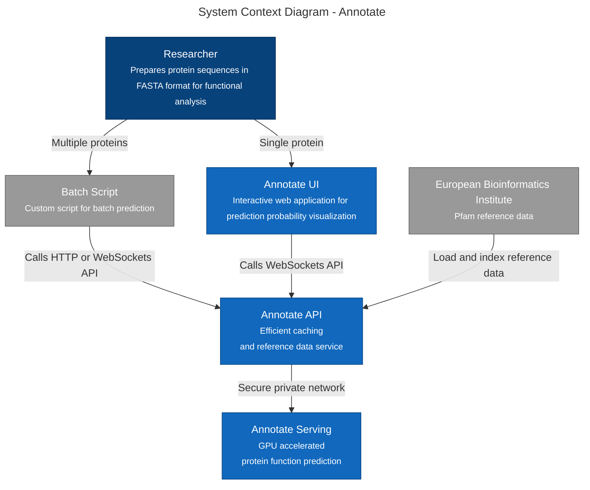
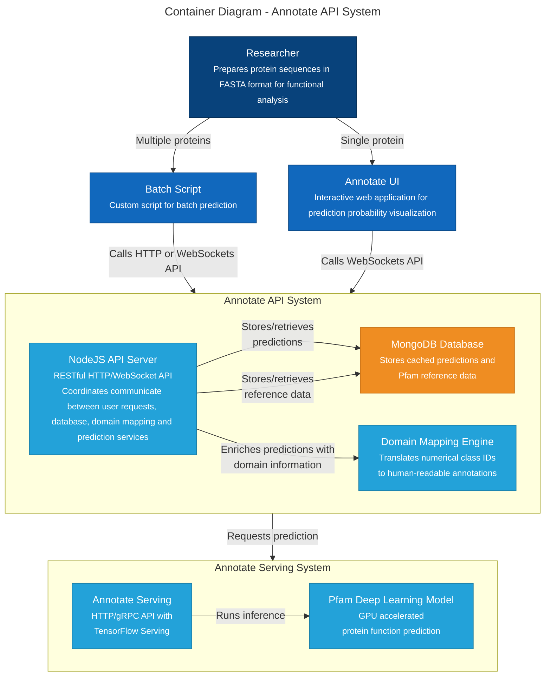
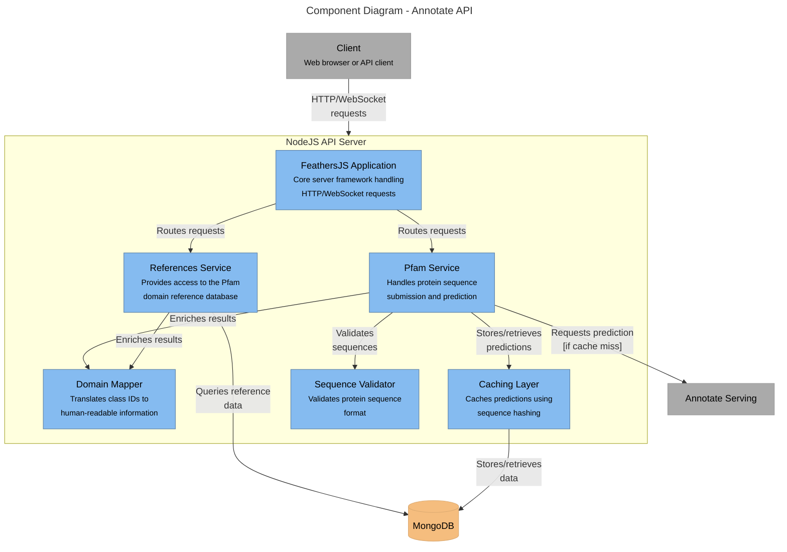
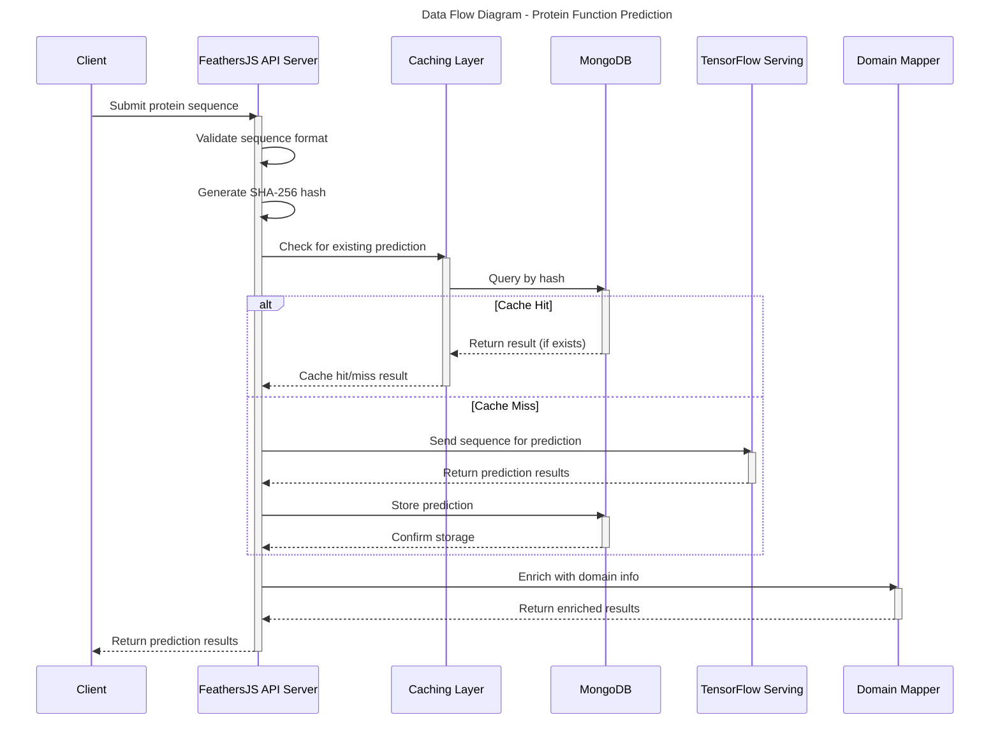

# Annotate API

A FeathersJS API for protein function prediction using TensorFlow Serving.

## Features

- RESTful API supports HTTP and WebSockets.
- Reduces load on the prediction server by caching predictions indexed by sequence hashing.
- Shields the prediction server from the internet by acting as a proxy to the prediction server.
- Translates the `classId` returned by the prediction service into `Pfam accession`, `clan accession`, `clan ID`, `Pfam ID`, and `Pfam description`.
- Lookup reference Pfam domain annotations for known uniprot accessions for comparison purposes.

## Technical Stack

The system architecture consists of four main components:

1. **FeathersJS API Server**

   - Core application server handling HTTP and WebSocket requests
   - Implements RESTful endpoints and real-time events
   - Manages authentication, authorization, and request validation
   - Coordinates communication between all other components

2. **TensorFlow Serving**

   - Dedicated model serving system running separately from the API server
   - Serves the Pfam deep learning model for protein function prediction
   - Provides high-performance GPU-accelerated inference
   - Communicates with the API server via REST

3. **MongoDB Database**

   - Persistent storage for prediction results and reference data
   - Stores cached predictions using sequence hashes as index keys
   - Maintains the Pfam reference database for comparison purposes
   - Provides efficient indexing for quick lookup of prediction results and reference annotations

4. **Domain Mapping Engine**
   - In-memory mapping system to enrich prediction results
   - Translates numerical class IDs to human-readable Pfam domain information
   - Adds contextual information about protein domains to prediction results

## Data Flow

The system follows this data flow for protein function prediction:

1. Client submits a protein sequence via REST API or WebSocket
2. API server validates the sequence format and generates a SHA-256 hash
3. System checks MongoDB for existing predictions using the hash as a key
4. If found (cache hit), the system returns the stored prediction immediately
5. If not found (cache miss), the sequence is sent to TensorFlow Serving
6. TensorFlow Serving performs inference using the Pfam model
7. Prediction results are cached in MongoDB
8. Domain mapping engine enriches results with human-readable domain information and return in the client

## Services

1. **Pfam Service**

   - Handles protein sequence submission and prediction
   - Implements caching logic using sequence hashing
   - Coordinates with TensorFlow Serving for model inference
   - Enriches the results with human-readable domain information:
     - `pfamAcc` - The Pfam accession number (e.g., "PF00049")
     - `pfamId` - The Pfam ID (e.g., "Insulin")
     - `pfamDesc` - Description of the domain
     - `clanAcc` - Clan accession if available
     - `clanId` - Clan ID if available

2. **References Service**

   - Provides access to the Pfam domain reference database
   - Allows querying of reference annotations by various parameters
   - Each reference record contains:
     - `seqAcc` - The sequence accession ID
     - `refName` - The reference name
     - `pfamAcc` - The Pfam accession number (e.g., "PF00049")
     - `start` - The start position of the domain in the protein sequence
     - `end` - The end position of the domain in the protein sequence
   - Enriches the results with human-readable domain information:
     - `pfamId` - The Pfam ID (e.g., "Insulin")
     - `pfamDesc` - Description of the domain
     - `clanAcc` - Clan accession if available
     - `clanId` - Clan ID if available

# Setup

## Prerequisites

- Node.js (v22 or higher)
- MongoDB
- TensorFlow Serving

## Installation

1. Clone the repository:

```bash
git clone https://github.com/your-username/annotate-api.git
cd annotate-api
```

2. Install dependencies:

```bash
npm install
```

3. Configure the database connection in `config/default.json`.

4. Start the dev server:

```bash
npm run dev
```

4.1 Start the production server:

```bash
npm run compile
npm run start
```

# Configuration

- Configurations such as `host`, `port`, `mongodb`, `servingUrl` can be configured in the `config/default.json` file.
- Create separate configuration files (e.g., `config/production.json`, `config/development.json`)
- Configure different CORS settings for each environment

## CORS Configuration

The API supports Cross-Origin Resource Sharing (CORS), allowing the API to be accessed from web applications hosted on different domains.

1. **Single Origin**: The default configuration allows access only from `http://localhost:9000`

2. **Multiple Origins**: To allow multiple specific origins:

   ```json
   "origins": ["http://localhost:9000", "https://example.com", "https://app.yourdomain.com"]
   ```

3. **Allow All Origins** (not recommended for production):

   ```json
   "origins": "*"
   ```

### Security Best Practices

- Always restrict origins to specific trusted domains in production
- Never use wildcard (`*`) origins in production environments
- Consider using HTTPS-only origins for production

# Reference Data Setup

1. Create the reference directory structure (if not already present):

```bash
mkdir -p reference-regions/Pfam31.0
mkdir -p reference-regions/Pfam32.0
```

2. Download the Pfam reference files:

   For Pfam31.0:

   ```bash
   # Download from the European Bioinformatics Institute (EBI)
   wget ftp://ftp.ebi.ac.uk/pub/databases/Pfam/releases/Pfam31.0/Pfam-A.regions.uniprot.tsv.gz -P reference-regions/Pfam31.0/

   # Decompress the file
   gunzip reference-regions/Pfam31.0/Pfam-A.regions.uniprot.tsv.gz
   ```

   For Pfam32.0:

   ```bash
   # Download from the European Bioinformatics Institute (EBI)
   wget ftp://ftp.ebi.ac.uk/pub/databases/Pfam/releases/Pfam32.0/Pfam-A.regions.uniprot.tsv.gz -P reference-regions/Pfam32.0/

   # Decompress the file
   gunzip reference-regions/Pfam32.0/Pfam-A.regions.uniprot.tsv.gz
   ```

   Note: These files are large (6-10GB) and may take some time to download and decompress.

3. Load the reference data into the MongoDB database:

```bash
# Make sure MongoDB is running
npm run db:load-references
npm run db:index-references
```

This process will parse the Pfam reference files and populate the database with domain information, which will be displayed alongside prediction results in the frontend user interface.

## Backup and Restore the MongoDB references collection

```bash
mongodump --uri="mongodb://localhost:27017/annotateDB" --collection=references
mongorestore --uri="mongodb://localhost:27017/annotateDB" --collection=references dump/annotateDB/references.bson
```

## How Reference Data is Used

The reference data loaded from the Pfam reference files populates the database collection that the References service provides access to. This service allows you to:

1. Query known domain annotations for protein sequences from the Pfam database
2. Compare prediction results with curated reference annotations
3. Validate the accuracy of the Pfam model predictions
4. Research specific domains across different proteins

The References service automatically enriches the retrieved data with additional Pfam family information, including domain descriptions and clan details, making it easier to interpret the results without needing to perform additional lookups.

# API Usage

### Predict Protein Function

**Endpoint:** `POST /pfam`

**Request Body:**

```json
{
  "sequence": "MALWMRLLPLLALLALWGPDPAAAFVNQHLCGSHLVEALYLVCGERGFFYTPKTRREAEDLQGSLQPLALEGSLQKRGIVEQCCTSICSLYQLENYCN"
}
```

**Response:**

```json
{
  "_id": "7f83b1657ff1fc53b92dc18148a1d65dfc2d4b1fa3d677284addd200126d9069",
  "sequence": "MALWMRLLPLLALLALWGPDPAAAFVNQHLCGSHLVEALYLVCGERGFFYTPKTRREAEDLQGSLQPLALEGSLQKRGIVEQCCTSICSLYQLENYCN",
  "createdAt": 1626456531000,
  "predictions": {
    "classes": [1, 1, 1, 4877, 4877, ...],
    "top_classes": [[1, 4085, 14772], [1, 14772, 4085], ...],
    "top_probs": [[0.999651432, 3.57837489e-5, 3.53951364e-5], ...]
  },
  "domainMap": {
    "1": {
      "pfamAcc": "NO_DOMAIN",
      "pfamId": "NO_DOMAIN",
      "pfamDesc": "No Domain",
      "clanAcc": "",
      "clanId": ""
    },
    "4877": {
      "pfamAcc": "PF00049",
      "pfamId": "Insulin",
      "pfamDesc": "Insulin/IGF/Relaxin family",
      "clanAcc": "CL0239",
      "clanId": "Insulin"
    },
    "4085": {
      "pfamAcc": "PF16981",
      "pfamId": "Chi-conotoxin",
      "pfamDesc": "chi-Conotoxin or t superfamily",
      "clanAcc": "CL0083",
      "clanId": "Omega_toxin"
    },
    "14772": {
      "pfamAcc": "PF05324",
      "pfamId": "Sperm_Ag_HE2",
      "pfamDesc": "Sperm antigen HE2",
      "clanAcc": "",
      "clanId": ""
    }
    // Additional domain entries...
  }
}
```

## Get Prediction by ID

**Endpoint:** `GET /pfam/:id`

**Response:** Same as above

## Caching Functionality

The API implements efficient caching of protein function predictions:

1. When a protein sequence is submitted, a SHA-256 hash of the sequence is generated
2. This hash is used as the MongoDB document `_id`
3. Before calling the TensorFlow Serving API, the service checks if a prediction with this hash already exists
4. If found, the existing prediction is returned immediately without calling the TensorFlow Serving API
5. If not found, the TensorFlow Serving API is called, and the result is stored with the hash as its ID

This approach provides several benefits:

- Significantly faster responses for previously analyzed sequences
- Reduced load on the TensorFlow Serving API
- Consistent results for identical sequences
- Automatic deduplication of protein sequence data

## Domain Mapping

The API enriches prediction results with domain information:

1. For each class ID in the `top_classes` array, it retrieves the corresponding Pfam family information
2. The domain information is provided in the `domainMap` field of the response
3. Each entry includes:
   - `pfamAcc`: Pfam accession (e.g., "PF00049")
   - `pfamId`: Pfam ID (e.g., "Insulin")
   - `pfamDesc`: Description of the domain
   - `clanAcc`: Clan accession if available
   - `clanId`: Clan ID if available
4. The `domainMap` is only included in the API response and is not stored in the database

## Example Client

See `examples/pfam-create.js` for a simple example of how to use the API from a Node.js client. The example demonstrates both the initial API call and the cached response for repeated requests.

# Deploying to Google Cloud Compute Engine

## GCP Always Free Tier Notes

- https://cloud.google.com/free/docs/free-cloud-features
- Compute Engine
  - `e2-micro` in us-east1, us-west1, or us-central1.
  - 30 GB-months standard persistent disk
  - 1 GB-months of outbound data transfer

## Plan

- This VM will run MongoDB and the Feathers API server
- This VM is too slow to run `npm run db:load-references`, will need to use `mongorestore` instead
  - The `references` dump is 22.5 GB, create and attach a temporary 30GB PD to the VM to hold the dump
- `mongorestore` index failed on `e2-micro`
- try on `e2-standard-16`
  - create index took about 10 mins
  - Final disk usage is 18G

## Deploy

```bash
# Install MongoDB
sudo apt-get install gnupg curl
curl -fsSL https://www.mongodb.org/static/pgp/server-8.0.asc |    sudo gpg -o /usr/share/keyrings/mongodb-server-8.0.gpg    --dearmor
echo "deb [ signed-by=/usr/share/keyrings/mongodb-server-8.0.gpg ] http://repo.mongodb.org/apt/debian bookworm/mongodb-org/8.0 main" | sudo tee /etc/apt/sources.list.d/mongodb-org-8.0.list
sudo apt-get update
sudo apt-get install -y mongodb-org
sudo systemctl start mongod
# Upload the `references` dump to /mnt/disks/tmp/dump
mongorestore --uri="mongodb://localhost:27017/annotateDB" --collection=references /mnt/disks/tmp/dump/annotateDB/references.bson
# Install NodeJS
curl -fsSL https://deb.nodesource.com/setup_22.x | sudo -E bash -
sudo apt-get install -y nodejs
# Pull repo
sudo apt-get install -y git
cd ~
git clone https://github.com/hotdogee/annotate-api.git
cd annotate-api
npm i
```

### Setup https reverse proxy with nginx and let's encrypt

- https://certbot.eff.org/instructions?ws=nginx&os=pip

```bash
sudo apt install -y nginx
systemctl status nginx
sudo apt install -y python3 python3-venv libaugeas0
sudo python3 -m venv /opt/certbot/
sudo /opt/certbot/bin/pip install --upgrade pip setuptools
sudo /opt/certbot/bin/pip install certbot certbot-nginx
sudo ln -s /opt/certbot/bin/certbot /usr/bin/certbot
sudo certbot --nginx
sudo vi /etc/nginx/sites-available/api-ann.hanl.in.conf
```

```
server {
    listen 8582 ssl http2;
    listen [::]:8582 ssl http2 ipv6only=on;
    server_name api-ann.hanl.in;
    ssl_certificate /etc/letsencrypt/live/api-ann.hanl.in/fullchain.pem;
    ssl_certificate_key /etc/letsencrypt/live/api-ann.hanl.in/privkey.pem;
    include /etc/letsencrypt/options-ssl-nginx.conf;
    ssl_dhparam /etc/letsencrypt/ssl-dhparams.pem;

    location / {
        proxy_pass http://127.0.0.1:8581;  # The backend service address
        proxy_set_header Host $host;
        proxy_set_header X-Real-IP $remote_addr;
        proxy_set_header X-Forwarded-For $proxy_add_x_forwarded_for;
        proxy_set_header X-Forwarded-Proto $scheme;
        proxy_http_version 1.1;
        proxy_set_header Upgrade $http_upgrade;
        proxy_set_header Connection 'upgrade';
    }
}
```

```bash
sudo ln -s /etc/nginx/sites-available/api-ann.hanl.in.conf /etc/nginx/sites-enabled/api-ann.hanl.in.conf
sudo nginx -t
sudo systemctl reload nginx
echo "0 0,12 * * * root /opt/certbot/bin/python -c 'import random; import time; time.sleep(random.random() * 3600)' && sudo certbot renew -q && sudo systemctl reload nginx" | sudo tee -a /etc/crontab > /dev/null
echo "0 0 3 * * root /opt/certbot/bin/pip install --upgrade certbot certbot-nginx" | sudo tee -a /etc/crontab > /dev/null
```

## Test

```bash
curl -X POST -H "Content-Type: application/json" -d "{\"sequence\": \"MALWMRLLPLLALLALWGPDPAAAFVNQHLCGSHLVEALYLVCGERGFFYTPKTRREAEDLQGSLQPLALEGSLQKRGIVEQCCTSICSLYQLENYCN\"}" http://localhost:3030/pfam
curl -X POST -H "Content-Type: application/json" -d "{\"sequence\": \"MALWMRLLPLLALLALWGPDPAAAFVNQHLCGSHLVEALYLVCGERGFFYTPKTRREAEDLQGSLQPLALEGSLQKRGIVEQCCTSICSLYQLENYCN\"}" http://localhost:8581/pfam
```

```PowerShell
Invoke-WebRequest -Uri "http://localhost:3030/pfam" -Method POST -ContentType "application/json" -Body '{"sequence": "MALWMRLLPLLALLALWGPDPAAAFVNQHLCGSHLVEALYLVCGERGFFYTPKTRREAEDLQGSLQPLALEGSLQKRGIVEQCCTSICSLYQLENYCN"}'
Invoke-WebRequest -Uri "http://localhost:8581/pfam" -Method POST -ContentType "application/json" -Body '{"sequence": "MALWMRLLPLLALLALWGPDPAAAFVNQHLCGSHLVEALYLVCGERGFFYTPKTRREAEDLQGSLQPLALEGSLQKRGIVEQCCTSICSLYQLENYCN"}'
```

# Architecture Diagrams

### System Context Diagram



### Container Diagram



### Component Diagram



### Data Flow Diagram



### Model Component Diagram

```mermaid
---
title: Component Diagram for ANNotate Model Architecture
---
flowchart TD
    %% Main components
    input["Protein Sequence<br/>Input Layer"] --> embed["Embedding<br/>32-dim vectors"]
    embed --> dropout1["Dropout 20%"]

    %% Convolutional Bank subgraph - using a grid layout with invisible connections
    subgraph convbank["Convolutional Bank"]
        %% First row
        conv1["Conv1D<br/>k=1, 32 Filters"]
        conv3["Conv1D<br/>k=3, 32 Filters"]
        conv5["Conv1D<br/>k=5, 32 Filters"]
        conv7["Conv1D<br/>k=7, 32 Filters"]
        conv9["Conv1D<br/>k=9, 32 Filters"]

        %% Second row
        conv11["Conv1D<br/>k=11, 32 Filters"]
        conv13["Conv1D<br/>k=13, 32 Filters"]
        conv15["Conv1D<br/>k=15, 32 Filters"]
        conv17["Conv1D<br/>k=17, 32 Filters"]
        conv19["Conv1D<br/>k=19, 32 Filters"]

        %% Third row
        conv21["Conv1D<br/>k=21, 32 Filters"]
        conv23["Conv1D<br/>k=23, 32 Filters"]
        conv25["Conv1D<br/>k=25, 32 Filters"]
        conv27["Conv1D<br/>k=27, 32 Filters"]
        conv29["Conv1D<br/>k=29, 32 Filters"]

        %% Vertical connections for grid layout
        conv1 --- conv11 --- conv21
        conv3 --- conv13 --- conv23
        conv5 --- conv15 --- conv25
        conv7 --- conv17 --- conv27
        conv9 --- conv19 --- conv29
    end

    dropout1 --> convbank

    %% Post conv processing
    convbank --> concat["Concatenate"]
    concat --> batchnorm1["Batch Normalization"]
    batchnorm1 --> relu["ReLU Activation"]
    relu --> dropout2["Dropout 20%"]
    dropout2 --> res["Residual Connection"]
    %% Add residual connection from dropout1 to concat (showing the concatenation of embedded inputs with conv outputs)
    dropout1 --> res

    %% Highway Network subgraph
    subgraph highway["Highway Network"]
        hw1["Highway Layer 1<br/>512 units"]
        hw2["Highway Layer 2<br/>512 units"]
        hw3["Highway Layer 3<br/>512 units"]

        hw1 --> hw2 --> hw3
    end

    res --> highway

    %% Bidirectional RNN subgraph
    subgraph birnn["Bidirectional RNN"]
        gru1["BiGRU Layer 1<br/>512+512 units"]
        gru2["BiGRU Layer 2<br/>512+512 units"]
        gru3["BiGRU Layer 3<br/>512+512 units"]
        gru4["BiGRU Layer 4<br/>512+512 units"]

        gru1 --> gru2 --> gru3 --> gru4
    end

    highway --> birnn
    birnn --> batchnorm2["Batch Normalization"]
    batchnorm2 --> dense["Dense<br/>16,714 Pfam domain classes"]
    dense --> output["Output Layer<br/>Pfam domain probabilities<br/>for each amino acid<br/>in the sequence"]

    %% Node styling
    %% style input fill:#e8f4f8,stroke:#5b9bd5,color:black
    style embed fill:#e8f4f8,stroke:#5b9bd5,color:black
    style dropout1 fill:#e8f4f8,stroke:#5b9bd5,color:black
    style concat fill:#e8f4f8,stroke:#5b9bd5,color:black
    style batchnorm1 fill:#e8f4f8,stroke:#5b9bd5,color:black
    style relu fill:#e8f4f8,stroke:#5b9bd5,color:black
    style dropout2 fill:#e8f4f8,stroke:#5b9bd5,color:black
    style res fill:#e8f4f8,stroke:#5b9bd5,color:black
    style batchnorm2 fill:#e8f4f8,stroke:#5b9bd5,color:black
    style dense fill:#e8f4f8,stroke:#5b9bd5,color:black

    %% Style for all conv layers
    style conv1 fill:#e8f4f8,stroke:#5b9bd5,color:black
    style conv3 fill:#e8f4f8,stroke:#5b9bd5,color:black
    style conv5 fill:#e8f4f8,stroke:#5b9bd5,color:black
    style conv7 fill:#e8f4f8,stroke:#5b9bd5,color:black
    style conv9 fill:#e8f4f8,stroke:#5b9bd5,color:black
    style conv11 fill:#e8f4f8,stroke:#5b9bd5,color:black
    style conv13 fill:#e8f4f8,stroke:#5b9bd5,color:black
    style conv15 fill:#e8f4f8,stroke:#5b9bd5,color:black
    style conv17 fill:#e8f4f8,stroke:#5b9bd5,color:black
    style conv19 fill:#e8f4f8,stroke:#5b9bd5,color:black
    style conv21 fill:#e8f4f8,stroke:#5b9bd5,color:black
    style conv23 fill:#e8f4f8,stroke:#5b9bd5,color:black
    style conv25 fill:#e8f4f8,stroke:#5b9bd5,color:black
    style conv27 fill:#e8f4f8,stroke:#5b9bd5,color:black
    style conv29 fill:#e8f4f8,stroke:#5b9bd5,color:black

    style hw1 fill:#e8f4f8,stroke:#5b9bd5,color:black
    style hw2 fill:#e8f4f8,stroke:#5b9bd5,color:black
    style hw3 fill:#e8f4f8,stroke:#5b9bd5,color:black

    style gru1 fill:#e8f4f8,stroke:#5b9bd5,color:black
    style gru2 fill:#e8f4f8,stroke:#5b9bd5,color:black
    style gru3 fill:#e8f4f8,stroke:#5b9bd5,color:black
    style gru4 fill:#e8f4f8,stroke:#5b9bd5,color:black

    %% Subgraph styling
    style convbank fill:#f8f4e8,stroke:#ff9900,color:black
    style highway fill:#f8f4e8,stroke:#ff9900,color:black
    style birnn fill:#f8f4e8,stroke:#ff9900,color:black

    %% Connection styling
    linkStyle default stroke:#5b9bd5,stroke-width:2px

    %% Make all connections inside convolutional bank invisible
    %% The 2-11 links are the grid connections in the convbank
    linkStyle 2,3,4,5,6,7,8,9,10,11 stroke-opacity:0.0
```


